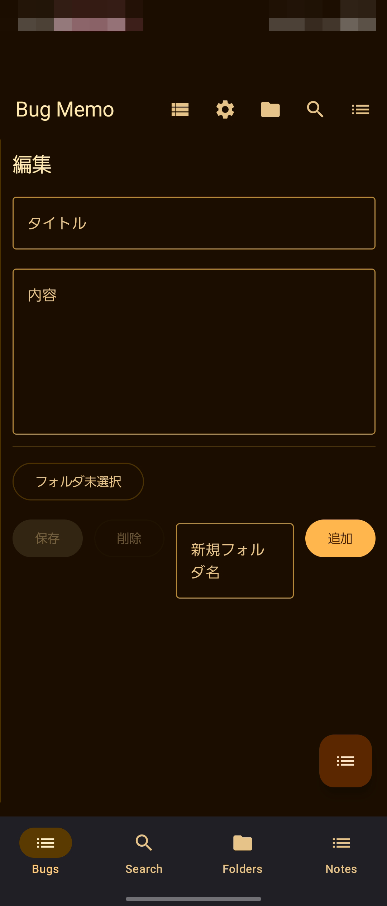
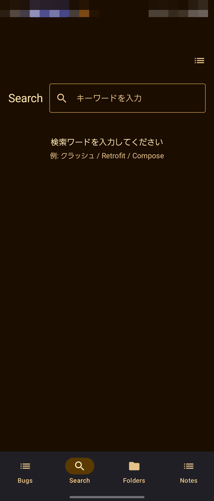
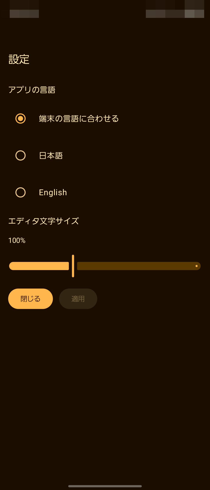

# BugMemo (Android / Kotlin / Compose)

モバイル開発中の バグやメモを素早く記録 するシンプルなノートアプリ。フォルダ分け・検索・（将来）マインドマップ表示に対応。

---

## 主な機能

- バグメモの作成・編集・削除（Undo で復元可）
- フォルダ管理（作成・削除・絞り込み）
- 検索（タイトル／本文の部分一致）
- スター付け（重要メモのマーキング）
- DataStore による検索語・絞り込みの永続化
- Room によるローカル永続化（マイグレーション対応）

## 画面構成

- Bugs: 一覧＋右ペイン編集（FAB から新規）
- Search: クエリ入力でリアルタイム検索、結果から編集へ
- Folders: フォルダ一覧・作成・削除、選択で絞り込み

## アプリ画面

<table>
<tr>
<td align="center">

<br>
<sub>ホーム</sub>
</td>
<td align="center">

<br>
<sub>検索</sub>
</td>
<td align="center">

<br>
<sub>マインドマップ</sub>
</td>
<td align="center">

<br>
<sub>設定</sub>
</td>
</tr>
</table>

## 技術スタック

- Kotlin / Coroutines / Flow
- Jetpack Compose (Material 3, Navigation, Lifecycle)
- Room (DAO / Migration)
- DataStore (Preferences)
- Unit Test（JUnit4）
- Lint & Spotless（ktlint 連携）による静的検査・整形

---

## セットアップ

# 依存解決・同期

```
./gradlew help
```

# デバッグビルド

```
./gradlew assembleDebug
```

品質チェック

# コード整形（全体を自動修正）

```
./gradlew spotlessApply
```

# 整形チェック（CI と同等）

```
./gradlew spotlessCheck
```

# Lint（baseline あり）

```
./gradlew lint
```

# ユニットテスト

```
./gradlew test
```

Lint で baseline created と出た場合はローカルで baseline をコミットして再実行してください。

# ローカルで先に整形(コミット前)

```
./gradlew spotlessApply && ./gradlew spotlessCheck
```

## 開発メモ（Architecture 概要）

- NotesViewModel
  - UiEvent による Snackbar 通知（メッセージ／Undo）
  - query, filterFolderId を DataStore へ保存・復元
  - notes は（検索 × フォルダ）で動的フィルタ
- Repository 層
  - RoomNotesRepository（本番）／InMemoryNotesRepository（テスト）
- DB
  - AppDatabase v2（notes.isStarred 列を追加する Migration 1→2 実装）
- ナビゲーション
  - AppScaffold → AppNavHost → 各 Screen

---

## CI

GitHub Actions で以下をチェックします。

- spotlessCheck
- lint
- test

## 失敗時のよくある原因：

- README など “misc” 対象ファイルの末尾スペース／改行
- ktlint の import 並び順／命名規約
- baseline 未コミットによる Lint 失敗

## より理解度を深める為に/アーキテクチャについて

- docs/app_scaffold.md
- docs/nav.md
- settingsscreen + appLocalemanager.md

## より理解度を深める為に/アルゴリズムについて

- algorithms.md
