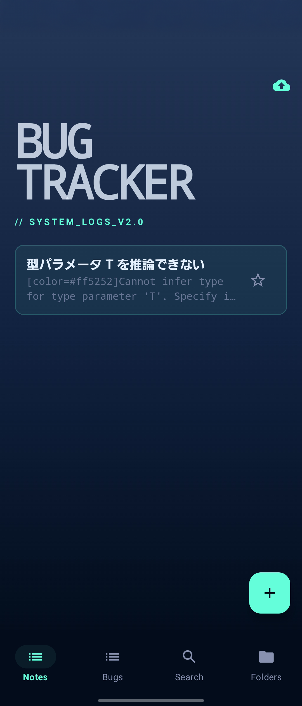
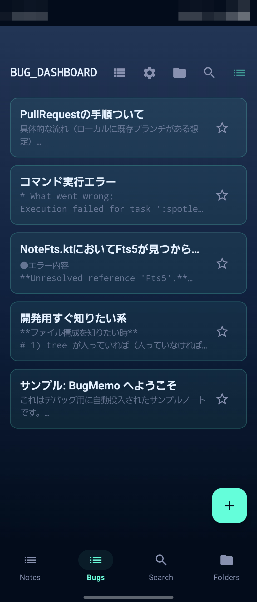
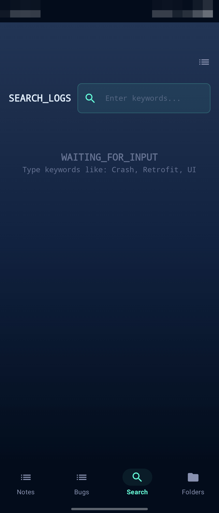
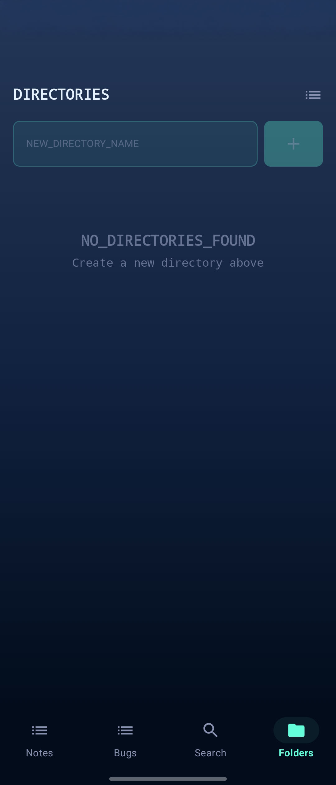
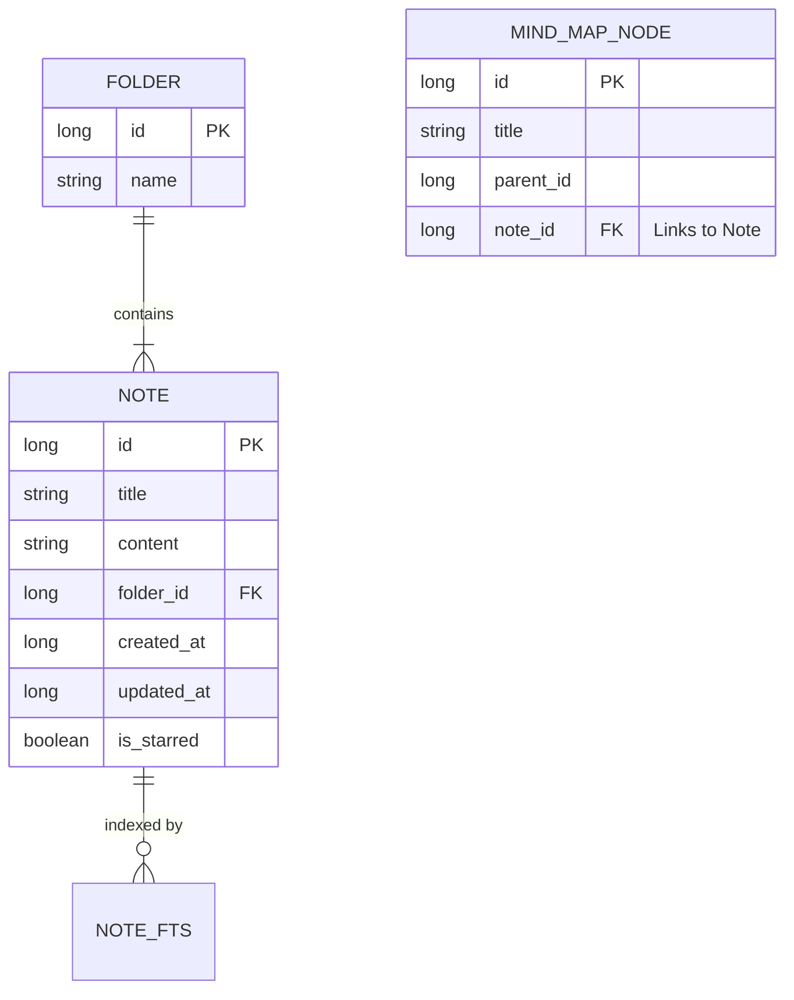

# 🧊 BugMemo: Iceberg Tech Edition

> **"Inject Knowledge into the Core."**

深海とテクノロジーをモチーフにした **「Iceberg Tech (Cyber-Glass Brutalism)」** デザインの、エンジニア向けバグトラッキング & ナレッジベースアプリ。

## 🚀 概要 (Overview)

BugMemo は、モバイル開発中に遭遇するバグや技術的な知見を、**「最速で記録し、構造化して整理する」** ためのツールです。

v2.0 の大規模リファクタリングにより、モダン Android 開発のベストプラクティス（Hilt, Edge-to-Edge, Version Catalog）を完全導入し、**「使っていて心地よい、没入感のある開発者体験」** を提供します。

## ✨ 主な機能 (Features)

## アプリ画面(新旧)

<table>
<tr>
<td align="center">

<br>
<sub>ホーム(新)</sub>
</td>
<td align="center">

<br>
<sub>ホーム(旧)</sub>
</td>
</tr>
</table>

## アプリ画面(新)

<table>
<tr>
<td align="center">

<br>
<sub>ホーム</sub>
</td>
<td align="center">

<br>
<sub>ダッシュボード</sub>
</td>
<td align="center">

<br>
<sub>検索</sub>
</td>
<td align="center">

<br>
<sub>ディレクトリ</sub>
</td>
</tr>
</table>

### 🧠 Thinking & Organizing

#### Mind Map Visualizer

思考を整理するためのマインドマップ機能。

- **永続化対応**: Room Database により、アプリを閉じてもデータは保持されます
- **Deep Link**: ノードからワンタップで「詳細ノート」を新規作成・リンク可能
- **回路図デザイン**: サイバーパンクな配線デザインを採用

#### High-Speed Search (FTS4)

SQLite の全文検索エンジン（FTS4）を採用し、大量のログからも瞬時にキーワード検索が可能。

#### Folder Management

プロジェクトやトピックごとのフォルダ分けと絞り込み表示。

### 📝 Editing & Logging

#### Markdown Editor

- **シンタックスハイライト**: `**Bold**` や `Link` などの Markdown 記法をリアルタイムで装飾表示
- **Iceberg UI**: ガラスのような半透明入力パネルと、ネオンカラーのアクセント

#### Quick Capture (Injector 連携)

別途開発のサテライトアプリ「Injector」や、Android の共有メニューからテキストを受け取り、自動でタイトルを生成して保存。

### ☁️ Connectivity

#### GitHub Gist Sync

Personal Access Token を設定することで、ノートを GitHub Gist に Markdown としてバックアップ可能。チームへの共有や PC での閲覧がシームレスに。

## 🛠️ 技術スタック (Tech Stack)

### Architecture

#### MVVM + Clean Architecture (Pragmatic)

UI → ViewModel → Repository → DataSource (Dao/API) の単方向データフロー。

#### Dependency Injection

`Hilt`を全面採用し、手動 Factory を廃止。`AppModule`による依存関係の一元管理。

#### Single Source of Truth

画面状態は`StateFlow`で管理し、Room データベースを信頼できる唯一の情報源とする。

### Libraries & Tools

- **Language**: Kotlin 2.0
- **UI**: Jetpack Compose (Material 3)
  - **Edge-to-Edge**: ステータスバー透明化による完全没入 UI
  - **Animation**: `animateColorAsState`等によるマイクロインタラクション
- **Database**: Room (KSP, FTS4, Migration 1→3)
- **Build**: Gradle Kotlin DSL + Version Catalog (libs.versions.toml)
- **Quality**: Spotless (Ktlint), GitHub Actions (CI)

### Database Schema



## 💻 セットアップ & 開発ガイド

### 前提条件

- JDK 17
- Android Studio Ladybug 以降推奨

### ビルドコマンド

```bash
# 依存解決・同期
./gradlew help

# デバッグビルド
./gradlew assembleDebug

# コード整形（Spotless）
./gradlew spotlessApply

# テスト実行
./gradlew test
```

### CI (GitHub Actions)

Pull Request 作成時に、以下のワークフローが自動実行されます:

1. **Lint & Format**: Spotless によるコードスタイルチェック
2. **Unit Test**: JUnit4 によるロジック検証
3. **Build**: `assembleDebug`によるビルド検証

## 📂 プロジェクト構成

- **ui/**: 画面 (Screen) と ViewModel。Iceberg テーマ定義 (theme/)
- **data/**: Repository 実装、Room Entity/Dao、DataStore
- **domain/**: (Future) 純粋なビジネスロジック
- **di/**: Hilt Modules (AppModule)

---

_BugMemo - Inject Knowledge into the Core._
